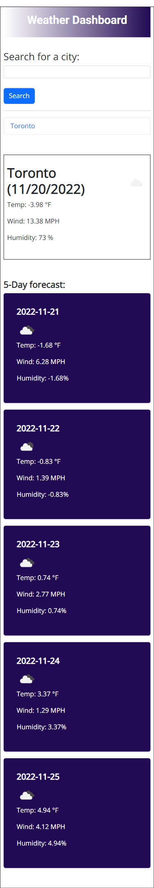
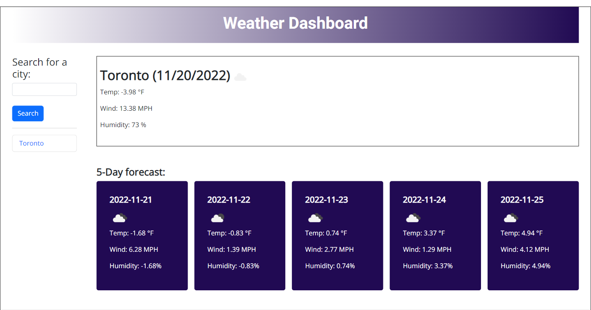

# Weather-dashboard-api

## Description

The motivation for the project was to help travelers plan vacation days by alowing them to search weather outlook for multiple cities.
The travler can search by city and will be presented with current and future conditions for that city and that city is added to the search history for later viewing.

The weather app pulls weather data from api.openweathermap.org API using powered by JavaScript, HTML, Flexbox, Bootstrap, CSS Grid jQuery and DayJs libray.

- Search results are stored in localStorage in local storage to allow data to persist.
- When history is clicked traveler is again presented with current and future conditions for that city.

## GitHub Links

[github URL:](https://github.com/DexterDick/weather-dashboard-api)

[github-pages URL](https://dexterdick.github.io/weather-dashboard-api/)

## Screenshot

;

;
